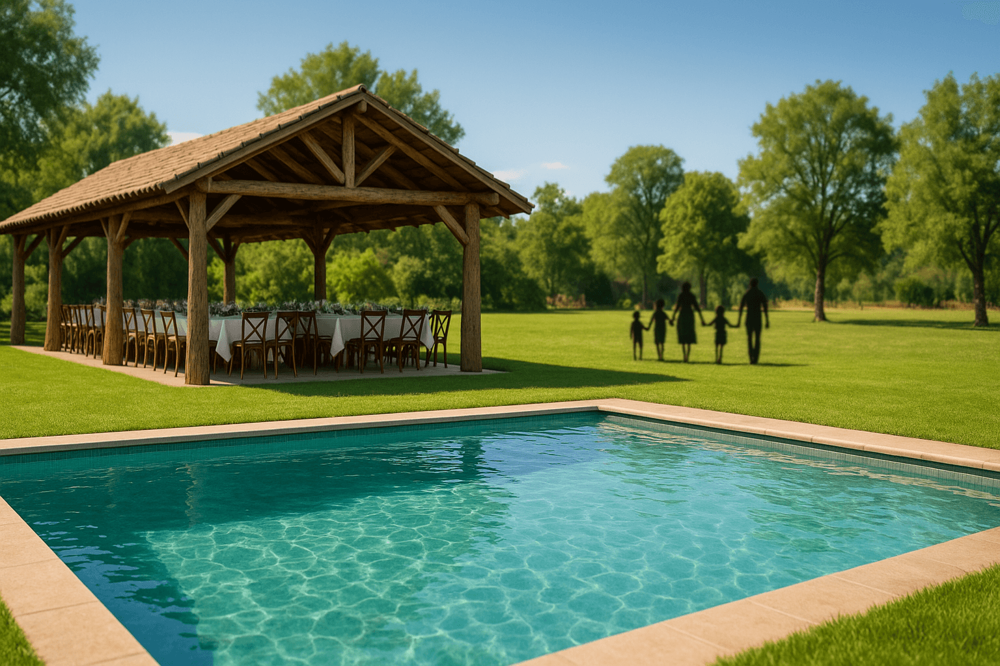
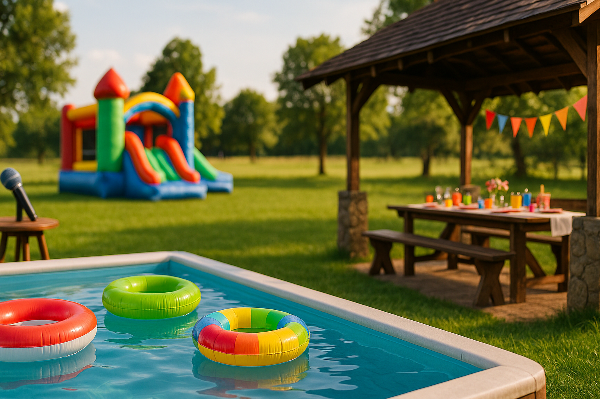

# Arca Noé - Landing Page



Landing page para el centro de eventos infantiles "Arca Noé" ubicado en Los Maitenes, San Vicente.

## 🎨 Características

- **Diseño responsive** con Tailwind CSS y animaciones suaves
- **Paleta de colores pastel armónica**: Lila, Celeste, Amarillo, Naranja suave, Verde menta, Rosa suave, Rojo CTA y Verde WhatsApp
- **Tipografías**: Poppins (títulos) e Inter (texto)
- **Scroll suave** con snap-scroll
- **Botón WhatsApp** flotante y accesible
- **Optimizado para SEO** con meta tags OpenGraph
- **Animaciones hover** y micro-interacciones
- **Accesibilidad mejorada** (roles, aria-labels, contraste)
- **Optimización de imágenes y fuentes**

## 🚀 Despliegue rápido

### Vercel

1. Sube el proyecto a un repositorio de GitHub
2. Ve a [vercel.com](https://vercel.com) y conecta tu cuenta de GitHub
3. Selecciona "New Project" y elige tu repositorio
4. Configura el proyecto:
   - **Framework Preset**: Other
   - **Build Command**: (dejar vacío)
   - **Output Directory**: (dejar vacío)
   - **Install Command**: (dejar vacío)
5. Haz clic en "Deploy"

### Netlify

1. Ve a [netlify.com](https://netlify.com)
2. Arrastra y suelta toda la carpeta del proyecto en la zona de deploy
3. ¡Listo! Tu sitio estará disponible en minutos

## 📁 Estructura del Proyecto

```
arcanoe/
├── index.html              # Página principal
├── public/                 # Imágenes y assets
│   ├── hero.jpg            # Imagen hero (reemplazar)
│   └── bg-services.png     # Fondo servicios (opcional)
└── README.md               # Este archivo
```

## 🖼️ Imágenes Requeridas

Reemplaza los archivos placeholder con las imágenes reales:

-  `public/hero.jpg` (1920x1080px, <100KB): Imagen principal del centro Arca Noé
-  `public/bg-services.png` (opcional): Imagen de fondo para la sección de servicios (puedes usar solo gradientes CSS)

## 🎯 Optimización y buenas prácticas

- Comprime imágenes con [TinyPNG](https://tinypng.com/) o [Squoosh](https://squoosh.app/)
- El sitio está optimizado para obtener 90+ en Lighthouse (Performance, Accessibility, Best Practices, SEO)
- Fuentes pre-cargadas para mejor rendimiento

## 📱 Contacto

- **WhatsApp**: +56 9 6394 9824
- **Ubicación**: Los Maitenes, San Vicente

## 🔧 Personalización

### Cambiar Colores

Modifica la paleta en el bloque de configuración de Tailwind en `index.html`:

```js
colors: {
    'lila': '#B6A4D4',
    'celeste': '#7CCDF8',
    'amarillo': '#FFDE89',
    'naranja-suave': '#FFBD7A',
    'verde-menta': '#A8E6CF',
    'rosa-suave': '#FFD1DC',
    'rojo-cta': '#FF6B6B',
    'verde-whatsapp': '#25D366'
}
```

### Modificar Contenido

Todo el contenido está en el archivo `index.html` con comentarios que identifican cada sección:

- `<!-- HERO -->`
- `<!-- SERVICES GRID -->`
- `<!-- LOCATION -->`
- `<!-- FIXED CONTACT -->`
- `<!-- FOOTER -->`

## 💡 Diseño emocional y recomendaciones

- Usa imágenes reales y alegres de niños y familias
- Agrega ilustraciones o iconos amigables en los servicios
- Aprovecha los colores pastel para transmitir alegría y confianza
- Micro-animaciones y efectos hover para dar vida a la experiencia
- Botón de WhatsApp siempre visible y accesible
- Accesibilidad: roles, aria-labels y contraste suficiente

---

© 2025 Arca Noé • Sitio demo